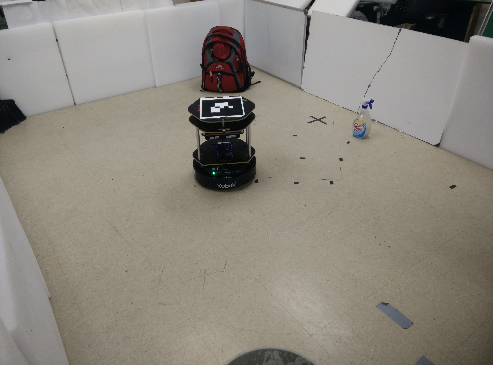
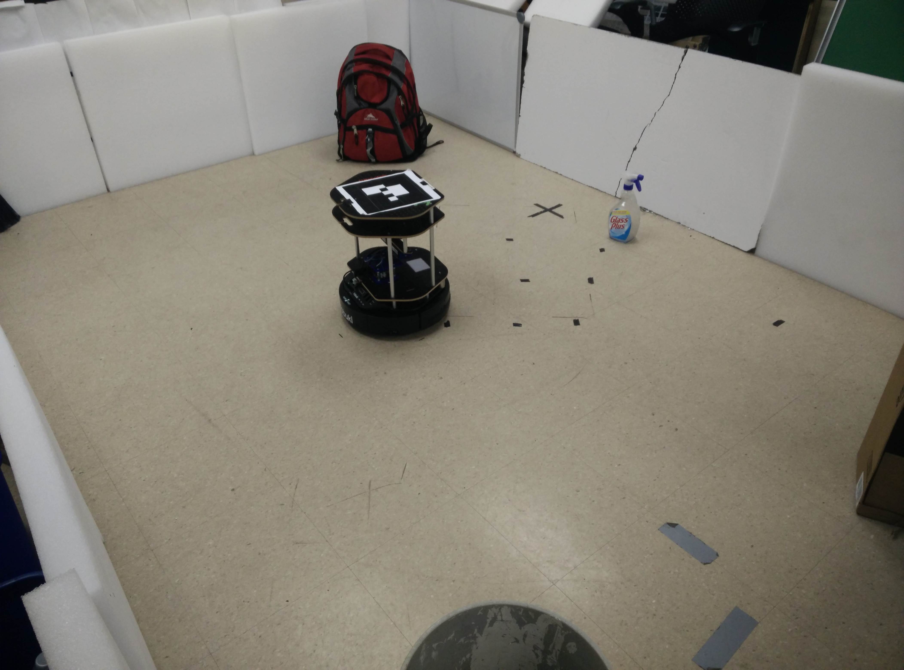
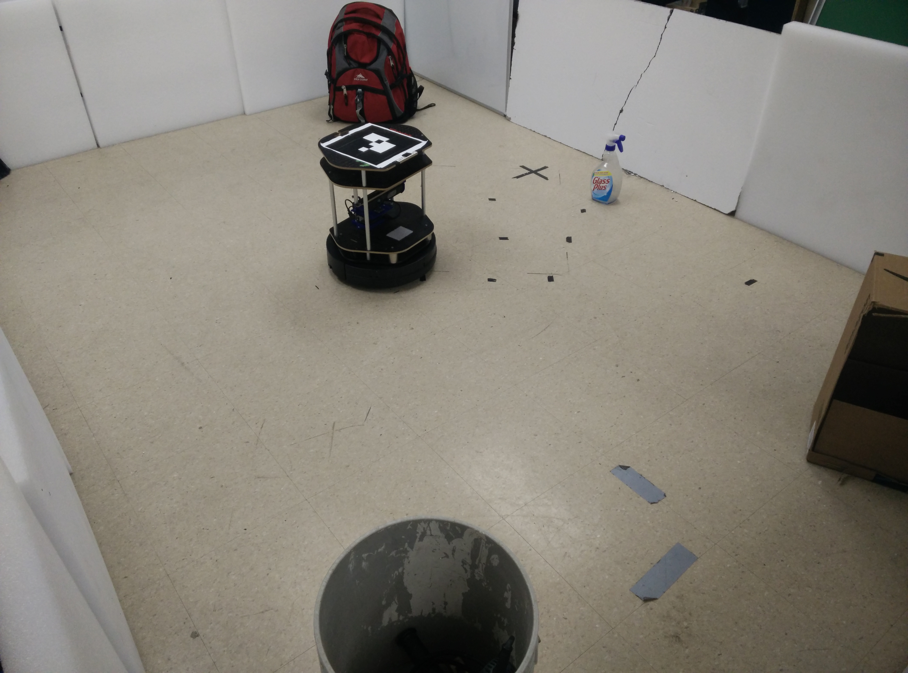
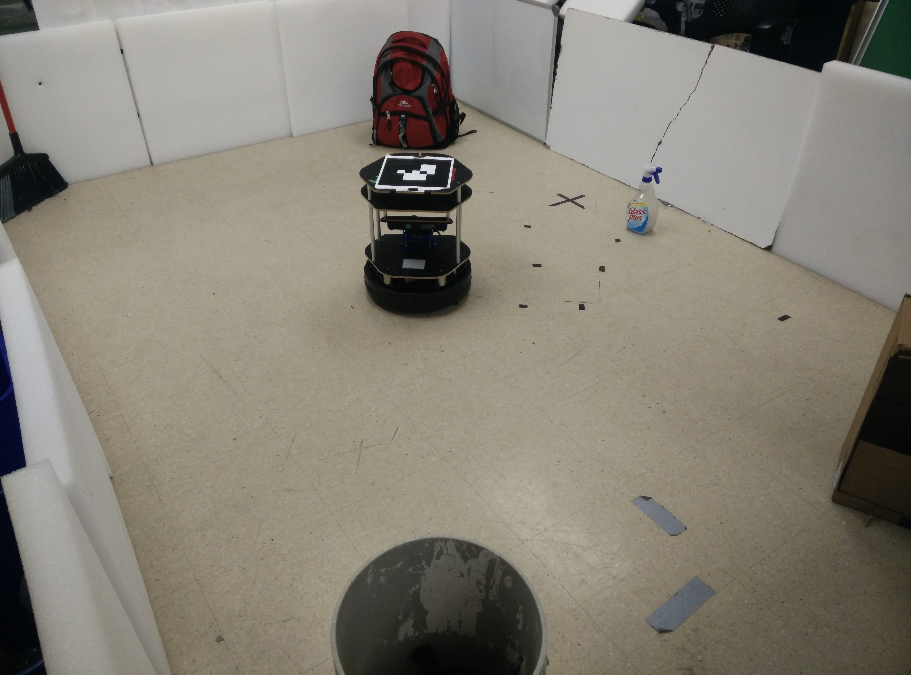
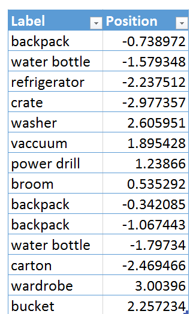
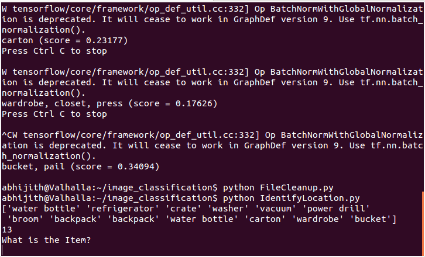
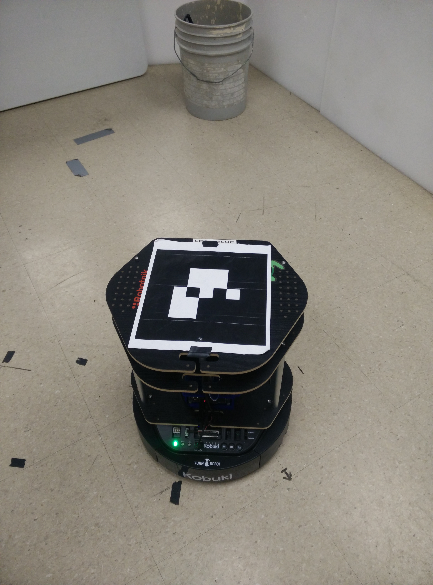
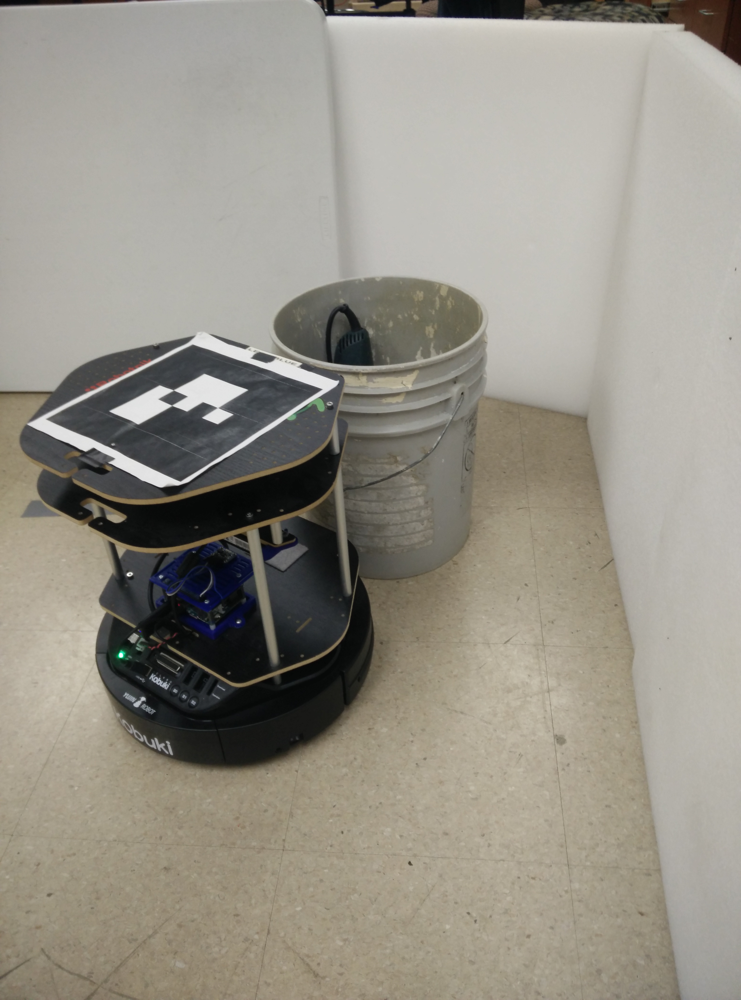

# Experimental Results

When the codes are executed as mentioned above, the Kobuki was able to rotate, take multiple images and pass them to modified Inception v3 engine. Figure below shows the Kobuki rotating from its initial position, taking images at fixed intervals.

     
  
  <em>Kobuki Turtlebot2 scanning the area environment with the vision sensor </em>

Figure below shows the terminal in which `Inception v3` engine using TensorFlow framework identifies different objects from the image. In the terminal, the identified object along with its accuracy (score) can be seen. 

  
  
  <em>Terminal window displaying output of Inception v3 engine. The displayed output shows a _backpack_ and a _broom_ were discovered in the last two images.</em>

The engine classifies the image and the object recognized were registered in a `Object Position Discovery` (OPD) file. The yaw angle from the initial position of the robot to each object was written in same OPD file against the recognized object label. Sample of a generated `Object Position Discovery` file containing each recognized object and the corresponding angles to the objects as shown in figure.

  
  
  <em> Sample of a generated Object Position Discovery file containing each recognized object and the corresponding angles to the objects</em>

The output of the `ImageIdentifier` script after cleaning up the csv file using `FileCleanup` script. All recognized objects were listed and ask the user to select the required object. Figure below a prompt to the user asking for the name of the discovered object.

  
  
  <em>Terminal displaying the output of the `IdentifyLocation` script. The displayed output shows a prompt to the user asking for the name of the discovered object.</em>

The robot orients itself towards the required object once it gets an input from the user. At this point the `depthimage_to_laserscan` package was activated. ROS sensor visualization output displaying the _PointCloud_ image taken from the Asus Xtion RGB-D camera is shown in figure on left. Figure on right shows top view of simulated laser scan (_/scan_ ROS topic) from Asus Xtion. The distance of the object is calculated from this data.

   
  
  <em> OS sensor visualization output displaying the PointCloud image taken from the Asus Xtion RGB-D camera </em> 

  
  
 
  
  
  <em>Top view of simulated laser scan (_/scan_ ROS topic) from Asus Xtion </em>

After finding the distance to move, the robot starts moving towards the object. Figures below shows the movement of robot taken at various instances. The Kobuki will stop in front of the object keeping a safe distance.

    

